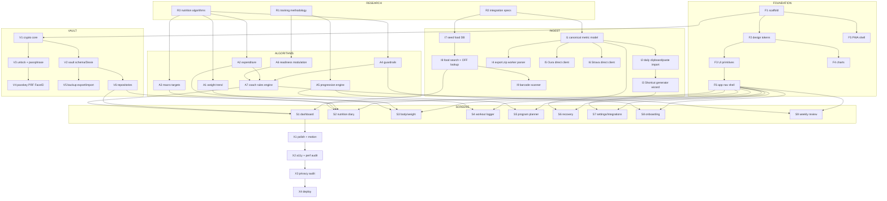

# Task Graph — atomic units & dependencies

Every node is sized to be completed by one agent in one sitting, with a checkable
done-condition. **Claim a node by posting to the channel before you start it.**

Status: `todo` · `wip` · `done` · `blocked`

---

## Dependency graph

---

## Nodes

### Research — no dependencies, ran first

| ID | Node | Done when | Status |
|---|---|---|---|
| R1 | Training methodology synthesis | `specs/training-methodology.md` + `exercise-library.json` (≥180, validated) + `program-templates.md` | wip |
| R2 | Integration specs (Health/Oura/Strava/food) | one spec per source, CORS reality documented, Shortcut action list precise | done; clipboard transport replaces the unsafe Safari fragment route |
| R3 | Nutrition algorithm specs + reference impls | 4 pure TS modules + a `verify.mjs` that runs and converges | wip |

### Foundation — depends only on scaffold

| ID | Node | Depends | Done when |
|---|---|---|---|
| F1 | Next.js/Vinext app-shell scaffold | — | `npm run build` emits the Sites worker and public assets | done |
| F2 | Design tokens & theme | F1 | tokens file + Tailwind theme, light+dark, iOS safe-area |
| F3 | UI primitives | F2 | Button/Card/Sheet/Tabs/Field/NumberPad/Toast/Skeleton, all themed |
| F4 | Chart primitives | F2 | dependency-free SVG line/bar/ring, theme-aware, per `dataviz` skill |
| F5 | PWA shell | F1 | manifest, icons, service worker, offline, iOS meta, install prompt |
| F6 | App nav shell | F3 | bottom tab bar, route transitions, standalone-mode chrome |

### Vault — the privacy core

| ID | Node | Depends | Done when |
|---|---|---|---|
| V1 | Crypto core | F1 | PBKDF2 KEK, AES-GCM wrap/unwrap, tested against known vectors |
| V2 | Dexie schema + encrypted record codec | V1 | tables defined, plaintext index fields documented |
| V3 | Unlock flow + passphrase setup | V1 | set / unlock / change / auto-lock, wrong-passphrase safe-fails |
| V4 | Passkey PRF (Face ID) unlock | V3 | optional second DEK wrapping, degrades cleanly where unsupported |
| V5 | Encrypted backup export / import | V2 | `.hcvault` round-trips; days-since-backup surfaced |
| V6 | Typed repositories | V2 | CRUD + query per domain, all encryption transparent to callers |

### Algorithms — pure, zero-dep, unit-tested

| ID | Node | Depends | Done when |
|---|---|---|---|
| A1 | Weight trend filter | R3 | converges on synthetic noisy data |
| A2 | Adaptive TDEE estimator | R3 | recovers true TDEE from 90d simulation within tolerance |
| A3 | Macro target generator | R3 | targets sane across cut/maintain/gain; rate-limited |
| A4 | Guardrails | R3 | blocks unsafe targets; structured findings |
| A5 | Training progression engine | R1 | week-to-week set/RIR progression + deload from volume landmarks |
| A6 | Readiness modulation | R1 | HRV/sleep/RHR → *bounded* load adjustment |
| A7 | Coach rules engine | A2,A4,A6 | ranked insights, every one guardrail-checked |

### Ingest

| ID | Node | Depends | Done when |
|---|---|---|---|
| I1 | Canonical metric model | R2 | one normalized shape all sources map into |
| I2 | Daily clipboard/paste import | I1 | validates HAE JSON, content-deduplicates, idempotently upserts, and records a receipt |
| I3 | Shortcut generator wizard | I2 | renders exact per-user Shortcut steps; copy/QR |
| I4 | `export.zip` streaming parser | I1 | Web Worker; 100MB+ file without freezing the UI |
| I5 | Oura direct client | I1 | works if CORS permits; honest UI if not |
| I6 | Strava direct client | I1 | ditto |
| I7 | Bundled seed food DB | R2 | ≥1000 foods, offline search |
| I8 | Food search + Open Food Facts | I7 | local-first, network optional, results cached |
| I9 | Barcode scanner | I8 | camera scan in iOS Safari, graceful fallback |

### Screens

| ID | Node | Depends | Done when |
|---|---|---|---|
| S8 | Onboarding | F6,A4 | passphrase, profile, goals, Add-to-Home-Screen, backup setup |
| S1 | Dashboard | F6,V6,A7 | today at a glance: macros, readiness, next session, insights |
| S2 | Nutrition diary | F6,A3,I8 | log a food in <5s; day + week view |
| S3 | Body / weight | F6,A1,A2 | trend chart, expenditure chart, measurements |
| S4 | Workout logger | F6,A5 | fast thumb-only set logging; **also logs trainer sessions** |
| S5 | Program planner | F6,A5 | mesocycle builder from templates + volume landmarks |
| S6 | Recovery | F6,I1 | sleep, HRV, readiness, activity |
| S7 | Settings & integrations | F6,I3 | connect flows, vault, backup, export, delete-everything |
| S9 | Weekly review | F6,A7 | the coaching moment: what happened, what changes |

### Cross-cutting

| ID | Node | Depends | Done when |
|---|---|---|---|
| X1 | Polish & motion | S1 | 60fps transitions, haptics, empty states, loading states |
| X2 | A11y & performance | X1 | keyboard/VO reachable, contrast AA, fast on a real phone |
| X3 | Privacy audit | X2 | **prove** no health data crosses the network; CSP verified |
| X4 | Deploy | X3 | private ChatGPT Site live, installable from the iPhone |

---

## Parallelisation plan

Independent fronts that can run simultaneously once F2 lands:

- **Front A — Vault:** V1 → V2 → V3/V5/V6
- **Front B — Design system:** F2 → F3 → F4 → F6
- **Front C — Algorithms:** A1–A7 (pure functions, no UI dependency at all)
- **Front D — Ingest:** I1 → I2/I4/I7/I8

Screens are the join point: they need Front B (UI) + Front A (data) + Front C (logic).
Everything before that is genuinely parallel.
